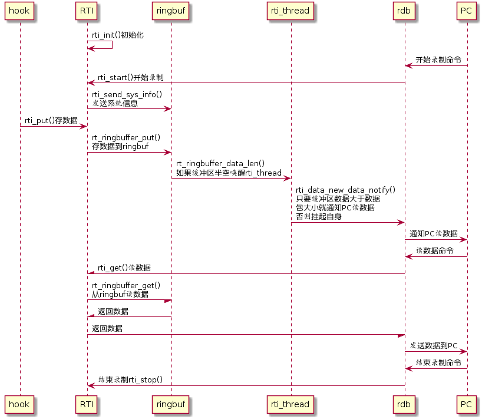

# RTI

## 介绍

RT-Thread Insight 是一个应用在 RT-Thread 上，用于展示系统内部运行信息的组件 。

它能够记录系统内部的中断、线程以及软件定时器的运行情况，并将记录的数据经过编码之后暂存到缓冲区中。然后等待 usb 、以太网、串口或其他方式读取并发送到PC端上。

### 目录结构

| 名称 | 说明 |
| ---- | ---- |
| docs  | 文档目录 |
| inc  | 头文件目录 |
| src  | 源代码目录 |

### 许可证


### 依赖

- RT-Thread 3.0+

## 获取方式

使用 rti package 需要在 RT-Thread 的包管理器中选择它，具体路径如下：

```
 RT-Thread online packages  --->
     system packages  --->
         [*] a rti package for rt-thread  --->
             rti version (v1.0.0)  --->
         (RT-Thread RTI) App name 
         (4096) RTI buffer size 
         (0x20000000) RAM base
         (2)   Event ID offset
         (I#15=systick) System description 0
         () System description 1
```

这些配置项的具体作用见下表：

| 配置               | 作用                                                         |
| ------------------ | ------------------------------------------------------------ |
| App name           | 配置APP的名称                                                |
| RTI buffer size    | 配置RTI 缓冲区大小                                           |
| RAM base           | 配置 RAM 的基地址                                            |
| Event ID offset    | 配置事件ID的偏移位数，值越大占用的内存越少。默认值：2        |
| System description | 配置系统描述符 作用是给中断事件起一个别名，默认中断标号15为systick |

配置完成后让 RT-Thread 的包管理器自动更新，或者使用 pkgs --update 命令更新包到 BSP 中。

## 使用示例 ##

例如：使用 rdb shell 和 rti 配合：

打开 rti package 后，还要打开 rdb package ，具体路径如下：
```
 Privated Packages of RealThread  --->
        [*] rdb:RT-Thread Debug Bridge                                                         
               rdb version (v1.0.1)  --->
```

rdb package 版本要选择  v1.0.1，并且下载到本地之后要手动将分支切换到远端最新代码然后重新生成工程

首先在 env 输入命令 `rdb shell` 进入rdb shell 模式，然后输入 rti_start_record 开始录制，输入 rti_stop_record 结束录制

录制的数据文件默认存放在  ” D:\RT-Thread_RTI.SVDat “

利用 SystemView 上位机加载录制的数据文件即可分析系统的运行状态。
### 工作机制 ###




## API 说明 ##

### API 列表 ###

| API                               | 作用                      |
| --------------------------------- | ------------------------- |
| rti_start                         | 启动 RTI                  |
| rti_stop                          | 关闭 RTI                  |
| rti_trace_disable                 | 屏蔽 RTI 监视事件开始     |
| rti_trace_enable                  | 屏蔽 RTI 监视事件结束     |
| rti_buffer_used                   | 查看 RTI 缓冲区已使用大小 |
| rti_data_get                      | 从 RTI 的缓冲区读出数据   |
| rti_data_new_data_notify_set_hook | 设置 RTI 新数据通知函数   |

### API 详解 ###

rti_start()

**函数原型** 

```
void rti_start(void);
```

这个函数的作用是启动 RTI

**函数参数** 无

**函数返回** 无


rti_stop()

**函数原型** 

```
void rti_stop(void);
```

这个函数的作用是关闭 RTI

**函数参数** 无

**函数返回** 无


rti_trace_disable()

**函数原型** 

```
void rti_trace_disable(rt_uint16_t flag);
```

这个函数的作用是使 RTI 不再监视与 flag 对应的系统事件

**函数参数**

| 参数 | 描述             |
| ---- | ---------------- |
| flag | 要屏蔽的事件名称 |

**可选参数** 如下：

```
RTI_SEM        /* 信号量 */
RTI_MUTEX      /* 互斥量 */
RTI_EVENT      /* 事件 */
RTI_MAILBOX    /* 邮箱 */
RTI_QUEUE      /* 消息队列 */
RTI_THREAD     /* 线程 */
RTI_SCHEDULER  /* 调度器 */
RTI_INTERRUPT  /* 中断 */
RTI_TIMER      /* 定时器 */
RTI_ALL        /* 所有的事件 */
```

**函数返回** 无

**使用范例**

在一些不想被 RTI 监控的地方可以用函数 rti_trace_disable() 和 rti_trace_enable() 配合将其屏蔽起来

```{.c}
rti_trace_disable(RTI_EVENT);
rt_event_send(rti_event, RTI_START_FLAG);
rti_trace_enable(RTI_EVENT);
```

因为两个函数运行之间发生的所有 EVENT 事件都将被屏蔽，所以两个函数之间被屏蔽的函数应尽量少的运行时间，更不能一直挂起等待事件到来。


rti_trace_enable()

**函数原型** 

```
void rti_trace_enable(rt_uint16_t flag);
```

这个函数的作用是使 RTI 恢复监视与 flag 对应的系统事件

**函数参数**

| 参数 | 描述             |
| ---- | ---------------- |
| flag | 要监视的事件名称 |

**可选参数** 与 rti_trace_disable 的一样

**函数返回** 无

**注意事项**

与函数 rti_trace_disable 配合使用，必须成对出现且传入参数也应一致。


rti_buffer_used

**函数原型** 

```
rt_size_t rti_buffer_used(void);
```

这个函数的作用是查询 RTI 缓冲区已使用的大小

**函数参数** 无

**函数返回**  RTI 缓冲区已经使用的字节数


rti_data_get

**函数原型** 

```
rt_size_t rti_data_get(rt_uint8_t *ptr, rt_uint16_t length);
```

这个函数的作用是从 RTI 的缓冲区里读出 length 大小的数据并存放到 ptr 指向的地址空间

**函数参数**

| 参数   | 描述                                  |
| ------ | ------------------------------------- |
| ptr    | 从 RTI 读出数据要存放的地址空间首地址 |
| length | 从 RTI 读出数据的长度                 |

**函数返回** 从 RTI 成功读出的数据的大小


rti_data_new_data_notify_set_hook

**函数原型** 

```
void rti_data_new_data_notify_set_hook(void (*hook)(void));
```

这个函数的作用是注册一个 RTI 的新数据通知函数，每当缓冲区的数据达到一个数据包的大小时，RTI 都会调用这个函数。

**函数参数**

| 参数 | 描述                     |
| ---- | ------------------------ |
| hook | 要注册的通知函数的函数名 |

**函数返回** 无

**使用范例**

可以在使用 RTI 之前先注册 RTI 的新数据通知函数

```{.c}
void rti_start_record(void)
{
    rti_data_new_data_notify_set_hook(rti_data_new_data_notify);
    rti_start();
}
```

也可以在这个函数里直接向外传输数据，不用一直调用函数 rti_buffer_used 检测缓冲区使用情况。


## 注意事项

> 说明：列出在使用这个 package 过程中需要注意的事项；列出常见的问题，以及解决办法。

